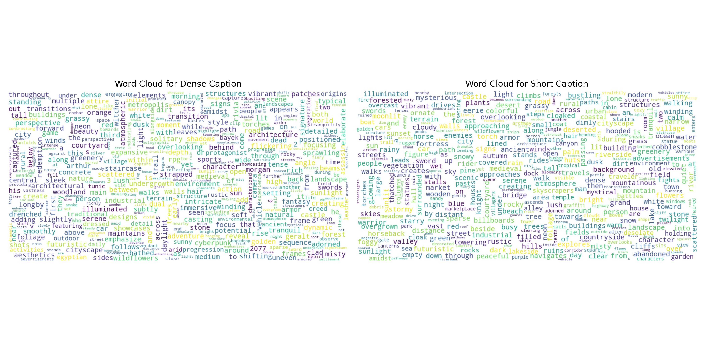

# GameGen-X
This repository is the official implementation of [GameGen-X](https://gamegen-x.github.io/).
It is the first diffusion transformer model tailored for the generation of open-world video game contents. 
This model facilitates high-quality, open-domain generation by simulating a wide array of game engine features, such as innovative characters, dynamic environments, complex actions, and diverse events. 

**[GameGen-X: Interactive Open-world Game Video Generation](https://gamegen-x.github.io/)** 
</br>
[Haoxuan Che*](https://chehx.github.io/)
[Xuanhua He*](https://xuanhuahe.github.io/),
[Quande Liu✉](https://liuquande.github.io/),
[Cheng Jin](https://academic.peterkam.top/),
[Hao Chen✉](https://cse.hkust.edu.hk/~jhc/),

(*Equal Contribution;✉Co-corresponding Authors)

[](https://gamegen-x.github.io/)


## OGameData
To promote research in game video generation, we released OGameDataset, the foundation of our model. This dataset comprises 1000k high-quality video-text pairs sourced from AAA-grade game footage, each annotated with high-density structured captions with fine-grained gameplay dynamics.


### Data Availability Statement
We are committed to maintaining transparency and compliance in our data collection and sharing methods. Please note the following:

- **Publicly Available Data**: The data utilized in our studies is publicly available. We do not use any exclusive or private data sources.

- **Data Sharing Policy**: Our data sharing policy aligns with precedents set by prior works, such as [InternVid](https://github.com/OpenGVLab/InternVideo/tree/main/Data/InternVid), [Panda-70M](https://snap-research.github.io/Panda-70M/) 
, and [Miradata](https://github.com/mira-space/MiraData). Rather than providing the original raw data, we only supply the YouTube video IDs necessary for downloading the respective content.

- **Usage Rights**: The data released is intended exclusively for research purposes. Any potential commercial usage is not sanctioned under this agreement.

- **Compliance with YouTube Policies**: Our data collection and release practices strictly adhere to YouTube’s data privacy policies and fair of use policies. We ensure that no user data or privacy rights are violated during the process.

- **Data License**: The dataset is made available under the Creative Commons Attribution 4.0 International License (CC BY 4.0).

### Clarifications

- The OGameData dataset is only available for informational purposes only. The copyright remains with the original owners of the video.
- All videos of the OGameData dataset are obtained from the Internet which is not the property of our institutions. Our institution is not responsible for the content or the meaning of these videos.
- You agree not to reproduce, duplicate, copy, sell, trade, resell, or exploit for any commercial purposes, any portion of the videos, and any portion of derived data. You agree not to further copy, publish, or distribute any portion of the OGameData dataset.

### Datadaset Construction Pipeline
#### Data Collection and Filtering
- **Sources**: Content was gathered from internet gameplay videos, focusing on gameplay footage with minimal UI elements.
- **Manual Filtering**: Low-quality videos were manually filtered out, ensuring the integrity of metadata such as game name, genre, and player perspective.

#### Data Processing Pipeline
- **Scene Segmentation**: Videos were segmented into 16-second clips using PyScene and TransNetV2, discarding clips shorter than 4 seconds.
- **Aesthetic Scoring**: Clips were scored using CLIP-AVA for aesthetic quality.
- **Motion Filtering**: UniMatch was used to filter clips based on motion.
- **Content Similarity**: VideoCLIP was employed to ensure content diversity.
- **Camera Motion Annotation**: CoTrackerV2 annotated clips with camera motion information.


### Dataset Overview
#### OGameData
The `OGameData` dataset consists of 1,000,000 video samples curated from online gaming content. Each data sample includes metadata on video paths, text descriptions, captions, timestamps, and source URLs. Three smaller datasets, containing 50k, 100K, and 250K samples respectively, are available for quick testing and experimentation. **More data is currently undergoing internal and external review, and we plan to release all remaining datasets by May 12.**


#### File Descriptions
- **`OGameData.csv`**: The full dataset, under review and coming soon.
- **`OGameData_250K.csv`**: A compact subset of 250,000 generation training samples, ideal for initial experimentation.
- **`OGameData_100K.csv`**: A subset of `OGameData` containing 100,000 generation training samples.
- **`OGameData_50K.csv`**: A smaller subset containing 50,000 generation training samples.

#### Data Fields
Each `.csv` file contains the following columns:
- **filename**: The video filename, derived from the original video ID and corresponding splitting ID, with a format such as `VIDEOID_scene-SPLITINGID.mp4`.
- **text**: Descriptive text accompanying each video clip with structural annotations.
- **short_caption**: A brief caption summarizing each video clip.
- **start_time**: The start time of the video segment in seconds.
- **end_time**: The end time of the video segment in seconds.
- **URL**: The source URL for each video, linking to the original content.

#### Example Data Entry
| Text | Short Caption | Start Time | End Time | URL | Filename |
|------|---------------|------------|----------|-----|----------|
| "Player achieves a new high score by defeating a boss" | "Player defeats boss" | 00:02:15 | 00:02:30 | `https://www.youtube.com/watch?v=video1` | `video1.mp4` |

#### Download Links
- **[OGameData_250K.csv](https://drive.google.com/file/d/1hd3aiGBiDClQMSqFZCheysg1K2zLPSm4/view?usp=drive_link)** (250,000 samples)
- **[OGameData_100K.csv](https://drive.google.com/file/d/1O80GdWI4BfhwWIIvEyoGZmBrK_NZae2k/view?usp=sharing)** (100,000 samples)
- **[OGameData_50K.csv](https://drive.google.com/file/d/1Zw4AofuVso53RCmNtx5GNN3MdFxhvg2H/view?usp=sharing)** (50,000 samples)

#### Statistics



### License
The `OGameData` dataset is available under the [Creative Commons Attribution 4.0 International License (CC BY 4.0)](https://creativecommons.org/licenses/by/4.0/). Please ensure proper attribution when using the dataset in research or other projects.

### Acknowledgement

Our dataset construction pipeline is inspired by and leverages the following repositories and resources:

- **[LAION-400 Open Dataset](https://laion.ai/blog/laion-400-open-dataset/)**
- **[InternVid](https://github.com/OpenGVLab/InternVideo/tree/main/Data/InternVid)**
- **[OpenVid-1M](https://github.com/NJU-PCALab/OpenVid-1M)**
- **[HD-VG-130M](https://github.com/daooshee/HD-VG-130M)**
- **[Vript](https://github.com/mutonix/Vript)**
- **[MiraData](https://github.com/mira-space/MiraData)**
- **[Panda-70M](https://snap-research.github.io/Panda-70M/)**
- **[OpenSora](https://github.com/hpcaitech/Open-Sora)**
- **[OpenSora-Plan](https://github.com/PKU-YuanGroup/Open-Sora-Plan)**

We extend our gratitude to the authors and contributors of these resources for their invaluable work and contributions to the field.

---

### Citation
If you use `OGameData` in your research, please cite it as follows:

```markdown
@inproceedings{che2024gamegen,
  title={GameGen-X: Interactive Open-world Game Video Generation},
  author={Che, Haoxuan and He, Xuanhua and Liu, Quande and Jin, Cheng and Chen, Hao},
  booktitle={International Conference on Learning Representations},
  year={2025},
  url={https://openreview.net/forum?id=8VG8tpPZhe},
}
```

### Contact

For questions, please open an issue on our [GitHub repository](https://github.com/GameGen-X/GameGen-X/issues) or reach out via our contact page.
